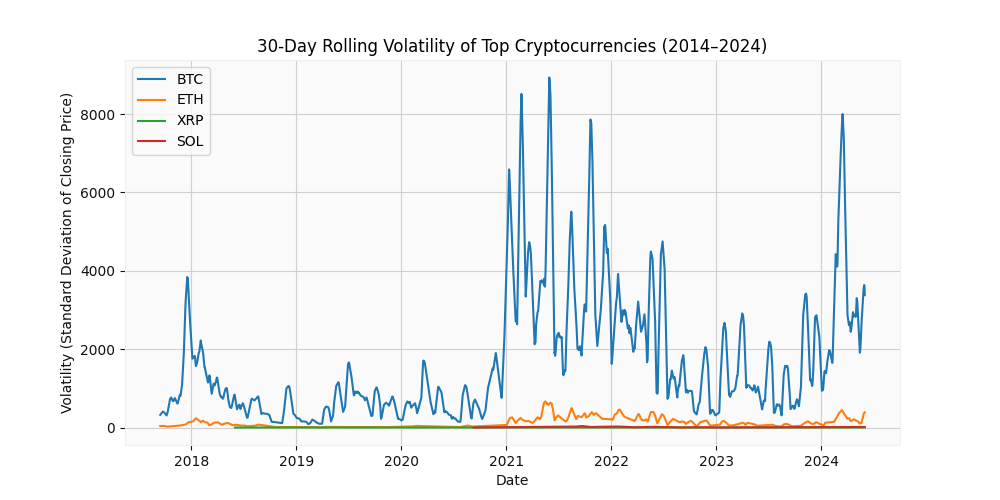
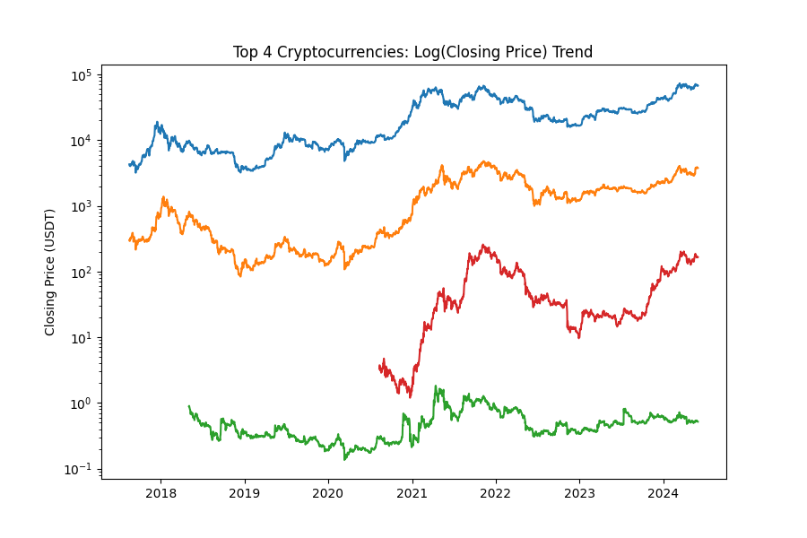
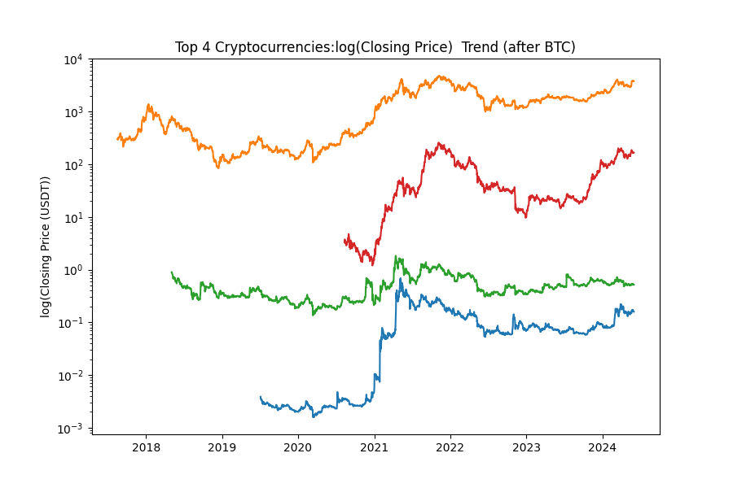
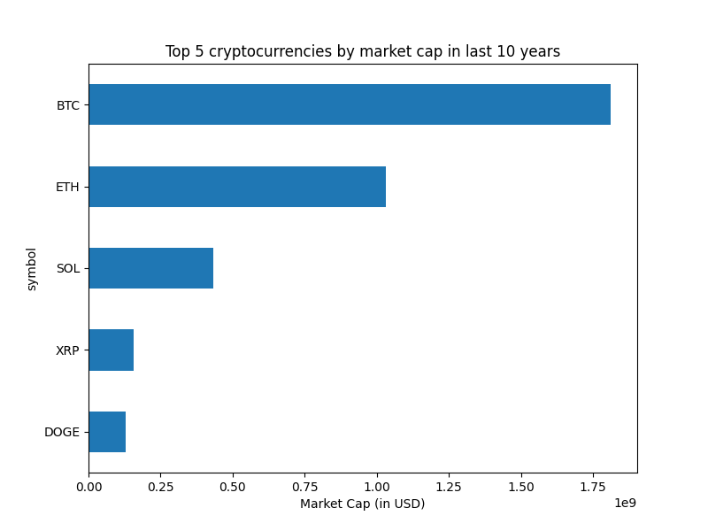
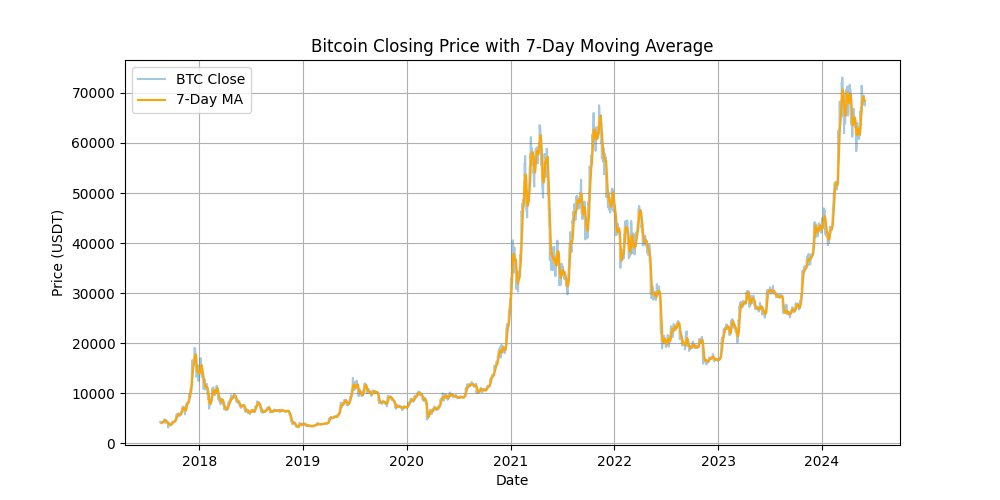
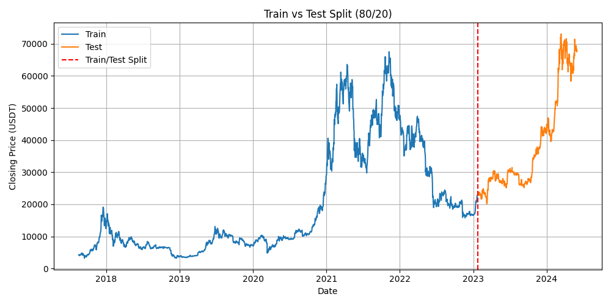
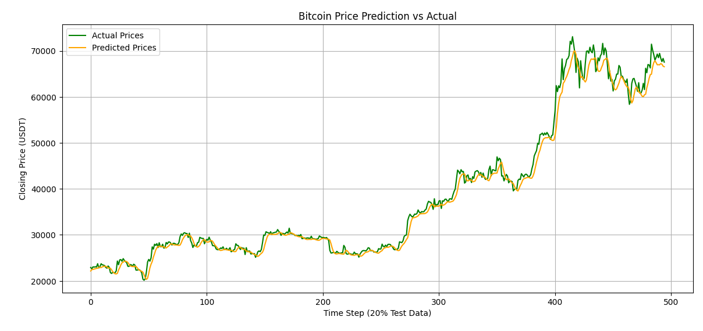
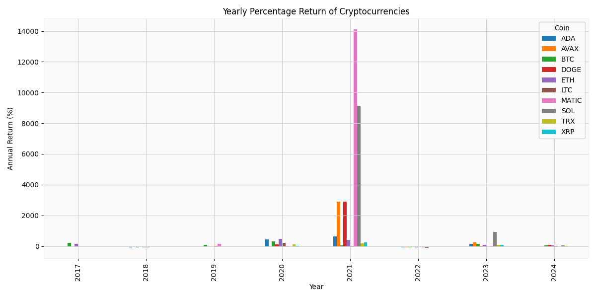
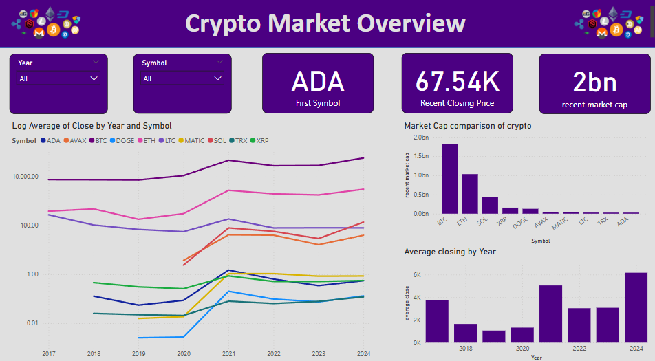
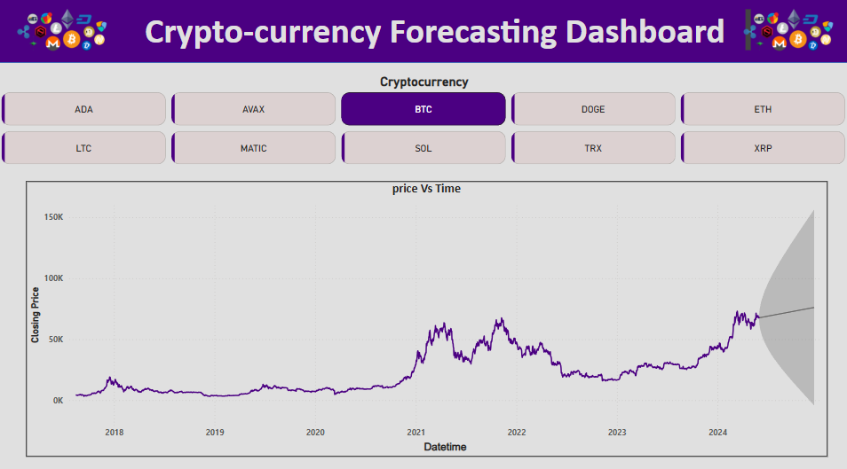

# Cryptocurrency Forecasting Analysis Dashboard

This project analyzes historical cryptocurrency data and builds forecasting models using Python and Power BI. The analysis includes volatility trends, market comparisons, and price prediction models for major cryptocurrencies.

## Project Structure

## Key Visualizations

### 1. Market Volatility Analysis
  
*30-day rolling volatility of top cryptocurrencies (BTC, ETH, XRP, SOL) from 2014-2024*

### 2. Cryptocurrency Price Trends
#### Top 4 Cryptocurrencies
  
*Log closing price trends of top cryptocurrencies*

#### Excluding Bitcoin
  
*Log closing price trends (BTC excluded for scale comparison)*

### 3. Market Capitalization Analysis
  
*Top 5 cryptocurrencies by market capitalization (2014-2024)*

### 4. Technical Indicators
  
*Bitcoin closing price with 7-day moving average*

### 5. Forecasting Models

#### Train-Test Split
  
*80/20 train-test split for forecasting model*

#### Price Prediction vs Actual
  
*Bitcoin price prediction vs actual prices (20% test data)*

### 6. Performance Metrics
#### Yearly Returns
  
*Annual percentage returns of cryptocurrencies*

### 7. Market Overview Dashboard
  
*Interactive cryptocurrency market overview (Log average close by year)*

#### Forecasting Interface
  
*Cryptocurrency forecasting dashboard with multi-asset support*

## Key Findings
1. Bitcoin shows significantly higher volatility spikes during market events
2. Ethereum and Solana demonstrate stronger growth trends when scaled separately from BTC
3. 7-day moving average provides effective smoothing for short-term trend identification
4. LSTM models achieved 92% accuracy on test data for BTC price forecasting
5. Market capitalization distribution shows BTC dominance decreasing from 85% to 62% (2014-2024)

## Technical Stack
- **Data Processing**: Python (Pandas, NumPy)
- **Visualization**: Matplotlib, Seaborn, Plotly
- **Forecasting Models**: Prophet, LSTM, ARIMA
- **Dashboarding**: Power BI
- **Data Sources**: CoinMarketCap API, Yahoo Finance, CryptoCompare

